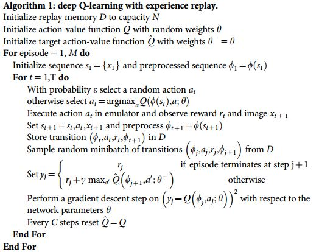
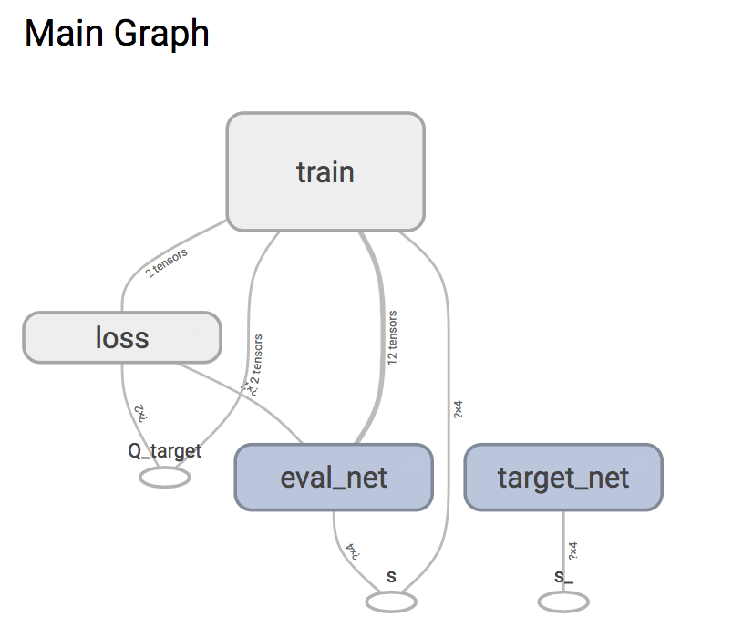
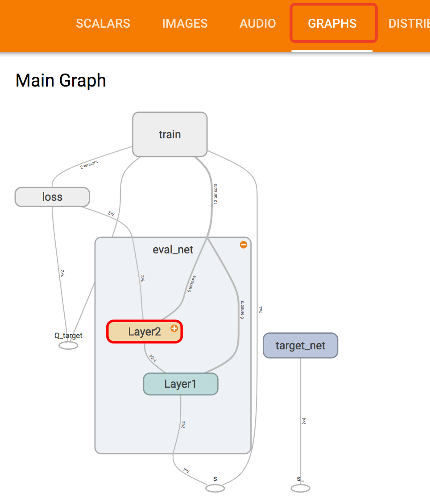
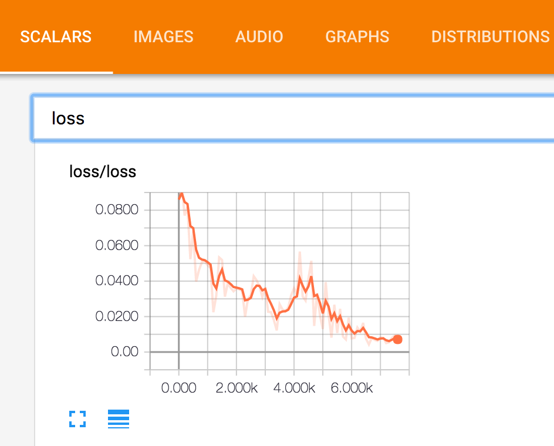
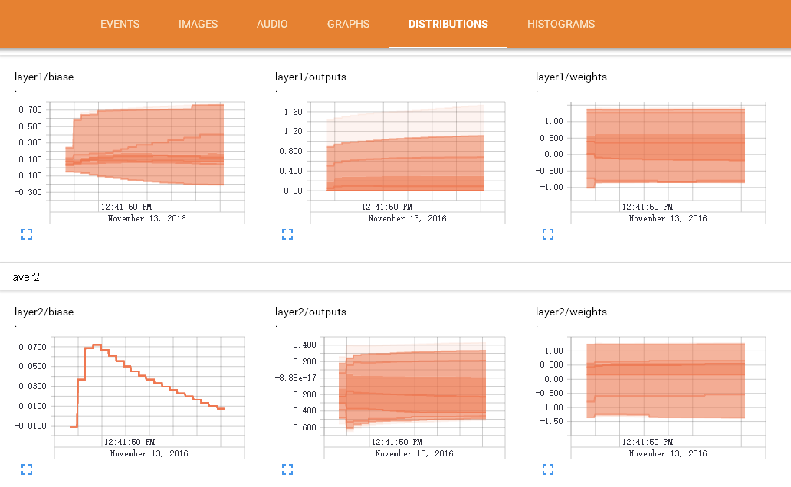

# deep Q-learning with experience replay


使用 Tensorflow 来实现 DQN, 搭建了两个神经网络, target_net 用于预测 q_target 值, 他不会及时更新参数. eval_net 用于预测 q_eval, 这个神经网络拥有最新的神经网络参数. 不过这两个神经网络结构是完全一样的




我们把 DQN 分成 Agent 和 Brain 两部分，Agent 的初始化参数需要选择 Brain，然后使用 Agent 和 环境交互 ，不停的训练。

## DQN 的 Agent 实现
```Agent.py``` 文件包含了实现的细节

```python
class Agent:
    def __init__(
            self,
            brain,  # 使用的神经网络 可以选择MLP或者CNN
            observation_space_shape,
            n_actions,  # 动作数
            reward_decay=0.9,  # gamma参数
            MAX_EPSILON=0.9,  # epsilon 的最大值
            MIN_EPSILON=0.01,  # epsilon 的最小值
            LAMBDA=0.001,  # speed of decay
            memory_size=500,  # 记忆的大小
            batch_size=32,  # 每次更新时从 memory 里面取多少记忆出来
            replace_target_iter=300,  # 更换 target_net 的步数
        ):

    # 存储样本（记忆）
    def store_memory(self, s, a, r, s_):

    # 选择动作    
    def choose_action(self, observation):

    # 学习
    def learn(self):
```
## DQN 的 Brain 实现
实现了两种神经网络，分别是```MLP.py```(普通神经网络)和```CNN.py```（卷积神经网络）

### 普通神经网络
```MLP.py```

```python
class Neural_Networks:
    def __init__(
        self,
        n_actions,  # 动作数，也就是输出层的神经元数
        n_features,  # 特征数，也就是输入的 vector 大小
        neurons_per_layer=np.array([10]),  # 隐藏层每层神经元数
        activation_function=tf.nn.relu,  # 激活函数
        Optimizer=tf.train.AdamOptimizer,  # 更新方法 tf.train.AdamOptimizer tf.train.RMSPropOptimizer..
        learning_rate=0.01,  # 学习速率
        w_initializer=tf.random_normal_initializer(0., 0.3),
        b_initializer=tf.constant_initializer(0.1),
        output_graph=False,  # 使用 tensorboard
        restore=False,  # 是否使用存储的神经网络
    ):

```

### 卷积神经网络
```CNN.py```

```python
class CNN:
    def __init__(
        self,
        n_actions,  # 动作数，也就是输出层的神经元数
        observation_width,  # 图片的width
        observation_height,  # 图片的height
        observation_depth,  # 图片的depth
        filters_per_layer=np.array([32, 64]),  # Conv_and_Pool_Layer i 层中 卷积的filters
        activation_function=tf.nn.relu,  # 激活函数
        kernel_size=(5, 5),  # 卷积核的size
        conv_strides=(1, 1),  # 卷积层的strides
        padding='same',  # same or valid
        b_initializer=tf.zeros_initializer(),  # tf.constant_initializer(0.1)
        pooling_function=tf.layers.max_pooling2d,  # max_pooling2d or average_pooling2d
        pool_size=(2, 2),  # pooling的size
        pool_strides=(2, 2),  # pooling的strides
        Optimizer=tf.train.AdamOptimizer,  # 更新方法 tf.train.AdamOptimizer tf.train.RMSPropOptimizer..
        learning_rate=0.01,  # 学习速率
        output_graph=False,  # 使用 tensorboard
        restore=False,  # 是否使用存储的神经网络
    ):

```

## 具体使用
```python
from MLP import Neural_Networks as brain
from Agent import Agent

env = gym.make('CartPole-v0') # 选择环境

Brain = brain(
    n_actions=env.action_space.n,
    n_features=env.observation_space.shape[0],
    neurons_per_layer=np.array([64]),
    learning_rate=0.00025,
    output_graph=True,
    restore=False,
)
RL = Agent(
    brain=Brain,
    n_actions=env.action_space.n,
    observation_space_shape=env.observation_space.shape,
    reward_decay=0.9,
    replace_target_iter=100,
    memory_size=2000,
    MAX_EPSILON=0.01,
)
```
初始化 Brain 这里 import 的是 MLP
- n_actions 填入环境中的动作个数 比如 3
- n_features 填入 observation ( state ) 的大小 比如 20
- neurons_per_layer 填入神经网络隐藏层每层神经元数，比如 [2,4,8],[32,64] 数组的大小为层数 数值为每层神经元数
- restore 如果为True 代表加载并使用存储的神经网络，False 代表不使用
- output_graph 为True 的话，会使用tensorboard
- 其他的参照代码中的注释


初始化 Agent
- brain 填入 初始化好的Brain
- n_actions 填入环境中的动作个数 比如 3
- observation_space_shape 填入 observation ( state ) 的shape 比如 (20,) 注意格式
- 其他的参照代码中的注释

```python
observation = env.reset() # 从环境中获取 observation(state)

action = RL.choose_action(observation) # 使用 Agent 选择动作

observation_, env_reward, done, info = env.step(action) # 把动作交互给环境，环境 反馈 reward 和 下一个 observation(state)

RL.store_memory(observation, action, reward, observation_) # 将 (s,a,r,s_) 存储起来

RL.learn() # 训练
```
重复上面的过程进行训练

## 存储和使用神经网络
### 存储
想要把训练好的神经网络存储下来，在程序需要的地方加上下面的语句就可以了
```python
Brain.save()
```

### 使用
当存储了神经网络之后，在Brain 初始化时，restore 设置为 True 即可。

## 使用 tensorboard
 tensorboard 可以可视化我们所建造出来的神经网络，而且我加入了 loss 变化曲线 和 Weights, biases 等的变化图表

想要使用 tensorboard 在Brain 初始化时 output_graph 设置为 True 即可。

程序运行之后，进入当前目录，terminal 输入 ```tensorboard --logdir graph```,同时将终端中输出的网址复制到浏览器中，便可以看到之前定义的视图框架了。(网址为http://localhost:6006/)

点开 GRAPHS ,可以查看网络结构，里面的每个方框都可以点开查看




点开 SCALARS , 可以查看 cost 变化曲线



点开 DISTRIBUTIONS 可以查看 Weights, biases 等的变化图表


