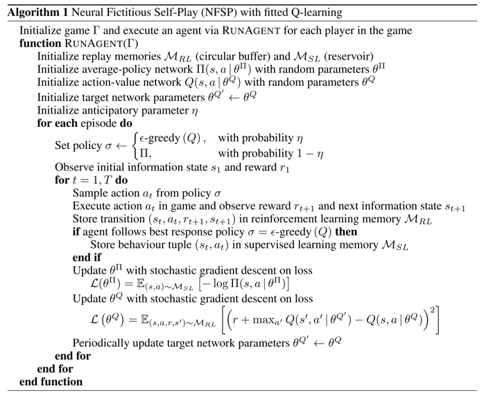
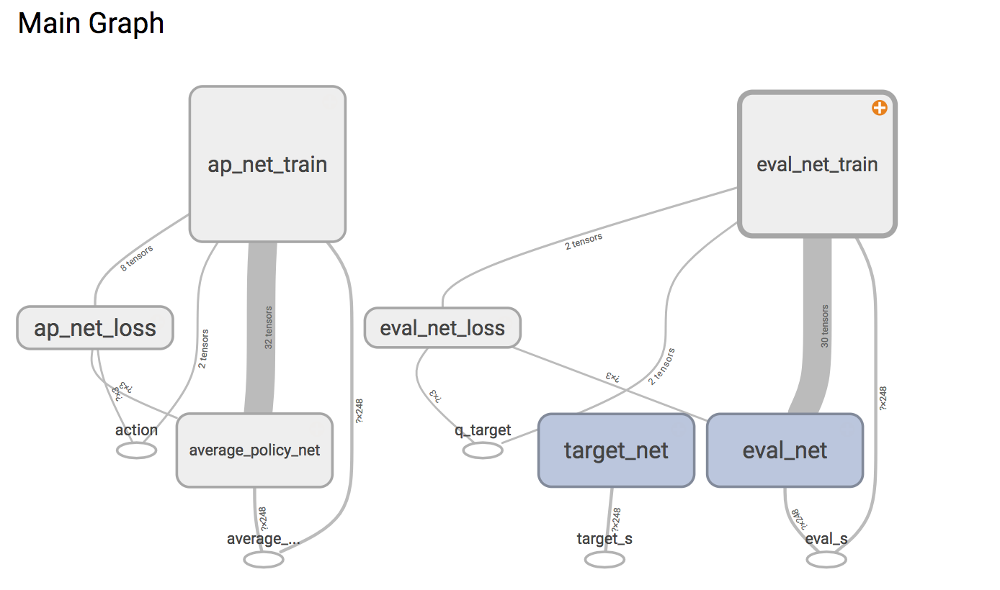

# Deep Reinforcement Learning from Self-Play in Imperfect-Information Games



- 使用强化学习去计算bestResponse
- 使用监督学习更新策略

使用 Tensorflow 来实现 NFSP, 搭建了三个神经网络.
target_net 用于预测 q_target 值,也就是Best Respose, 他不会及时更新参数.
eval_net 神经网络拥有最新的神经网络参数. 不过这两个神经网络结构是完全一样的。
average_policy_net 该神经网络用于更新策略



我们把 NFSP 分成 Agent 和 Brain 两部分，Agent 的初始化参数需要选择 Brain，然后使用 Agent 和 环境交互 ，不停的训练。

## NFSP 的 Agent 实现
```Agent.py``` 文件包含了实现的细节

```python
class Agent:
    def __init__(
        self,
        brain,  # 使用的神经网络
        information_state_shape,  # 信息状态的 shape
        n_actions,  # 动作数
        reward_decay=0.9,  # gamma参数
        MAX_EPSILON=0.88,  # epsilon 的最大值 0.08
        MIN_EPSILON=0.00,  # epsilon 的最小值
        LAMBDA=0.001,  # speed of decay
        RL_memory_size=6000,  # RL记忆的大小 600k
        SL_memory_size=20000,  # SL记忆的大小 20m
        RL_batch_size=256,  # 每次更新时从 RL_memory 里面取多少记忆出来
        SL_batch_size=256,  # 每次更新时从 SL_memory 里面取多少记忆出来
        replace_target_iter=1000,  # 更换 target_net 的步数 1000
        eta=0.1,  # anticipatory parameter
    ):

    # 设置 策略sigma
    def set_policy_sigma(self):

    # 存储样本（记忆）
    def store_memory(self, s, a, r, s_):

    # 选择动作    
    def choose_action(self, observation):

    # 学习
    def learn(self):
```
## NFSP 的 Brain 实现
```Brain.py``` 文件包含了实现的细节

```python
class Brain:
    def __init__(
        self,
        n_actions,  # 动作数，也就是输出层的神经元数
        n_features,  # 特征数，也就是输入的矩阵的列数
        eval_neurons_per_layer=np.array([1024, 512, 1024, 512]),  # eval_net 隐藏层每层神经元数
        ap_neurons_per_layer=np.array([1024, 512, 1024, 512]),  # ap_net 隐藏层每层神经元数
        activation_function=tf.nn.relu,  # 激活函数
        Optimizer=tf.train.AdamOptimizer,  # 更新方法 tf.train.AdamOptimizer tf.train.GradientDescentOptimizer..
        RL_learning_rate=0.001,  # 学习速率 0.1
        ML_learning_rate=0.0001,  # 学习速率 0.01
        w_initializer=tf.random_normal_initializer(0., 0.3),
        b_initializer=tf.constant_initializer(0.1),
        output_graph=False,  # 使用 tensorboard
        restore=False,  # 是否使用存储的神经网络
        checkpoint_dir='My_NFSP_Net',  # 存储的dir name
    ):
```
## 具体使用
```python
from NFSP.Agent import Agent
from NFSP.Brain import Brain as brain


Brain = brain(
    n_actions=3,
    n_features=248,
    restore=False,
    checkpoint_dir='My_NFSP_two_play_Net',
    output_graph=True,
)
RL = Agent(
    brain=Brain,
    n_actions=3,
    information_state_shape=(248,),
    replace_target_iter=100,
)


```
初始化 Brain 这里 import 的是 MLP
- n_actions 填入环境中的动作个数 比如 3
- n_features 填入 observation ( state ) 的大小 比如 20
- restore 如果为True 代表加载并使用存储的神经网络，False 代表不使用
- output_graph 为True 的话，会使用tensorboard
- 其他的参照代码中的注释


初始化 Agent
- brain 填入 初始化好的Brain
- n_actions 填入环境中的动作个数 比如 3
- information_state_shape 填入 observation ( state ) 的shape 比如 (20,) 注意格式
- 其他的参照代码中的注释

```python
observation = env.reset() # 从环境中获取 observation(state)

RL.set_policy_sigma() # 设置 策略 sigma

while 1:
    action = RL.choose_action(observation) # 使用 Agent 选择动作

    observation_, env_reward, done, info = env.step(action) # 把动作交互给环境，环境 反馈 reward 和 下一个 observation(state)

    RL.store_memory(observation, action, reward, observation_) # 将 (s,a,r,s_) 存储起来

    RL.learn() # 训练
```

## 存储和使用神经网络
### 存储
想要把训练好的神经网络存储下来，在程序需要的地方加上下面的语句就可以了
```python
Brain.save()
```

### 使用
当存储了神经网络之后，在Brain 初始化时，restore 设置为 True 即可。

## 使用 tensorboard
 tensorboard 可以可视化我们所建造出来的神经网络，而且我加入了 loss 变化曲线 和 Weights, biases 等的变化图表

想要使用 tensorboard 在Brain 初始化时 output_graph 设置为 True 即可。

程序运行之后，进入当前目录，terminal 输入 ```tensorboard --logdir graph```,同时将终端中输出的网址复制到浏览器中，便可以看到之前定义的视图框架了。(网址为http://localhost:6006/)


## 各种参数调整体会
### 经验回放大小 experience replay
agent把对环境的感知，放入经验回放中，作为神经网络的样本集合。
如果经验回放集合尺寸太小了，必然要选择丢弃部分经验，如果选择丢弃的经验是很重要的，就会给训练带来不稳定。如果不确定什么样的经验是可以丢弃的，就不要丢弃。
如果经验回放集合尺寸小了，agent就是失去在出生点附近失败的经验，结果就是在经验回放满了之后不久，agent在出生点附近失败的机会陡增，造成训练的不稳定。 输出的Q值在经验回放满之后达到最大值，之后随着经验的丢弃，Q值震荡，最后收敛到一个不好的值附近。
因此，选择什么经验存储，经验存储的大小，选择什么经验回放是很重要的问题。

### 神经网络结构
根据经验风险最小化的知识，神经网络的复杂度跟样本数量相关。因此，我想我们构造神经网络，要从输入状态的大小，任务的难度，经验回放的尺寸和e_greedy来考虑。

### GAMMA值
GAMMA值越高，表示我们希望agent更加关注未来，这比更加关注眼前更难，因此训练更加缓慢和困难。
GAMMA值并不是越高越好，实验来看，GAMMA值 = 0.9 反而效果最好

### 学习率
过高的学习率，在初期，样本数量不多的情况下，效果是很好的（虽然明显是过拟合了）。但随着学习样本数量增加，学习任务越来越复杂，过高的学习率导致收敛不好。
学习率如果设置太高，会使得梯度下降时候不稳定。
学习率建议设置的比较小。

### reward
设计回报值很重要。设计的目的是让正负回报能够相互对抗。
设计的准则之一是，让收敛时的Q值的均值，尽量接近0，此时各个动作的差异最容易体现。
准则之二是正回报要稍稍大一点，因为Q值的变化过程是先降低，然后慢慢提升，最初阶段是负回报统治的时期，人工的干预提升正回报，有助于训练。

## 遇到的问题
### Loss计算中出现NAN值
一般是输入的值中出现了负数值或者0值。
使用```tf.clip_by_value```函数限制输出的大小，将输出的值限定在 (1e-10, 1.0) 之间，避免了 log0 为负无穷的情况。
### 更新网络时出现NAN值
```
InvalidArgumentError (see abovefor traceback): Nan in summary histogram for: weight_1
```
这样的情况，是由于优化学习率设置不当导致的，而且一般是学习率设置过高导致的，因而此时可以尝试使用更小的学习率进行训练来解决这样的问题。
